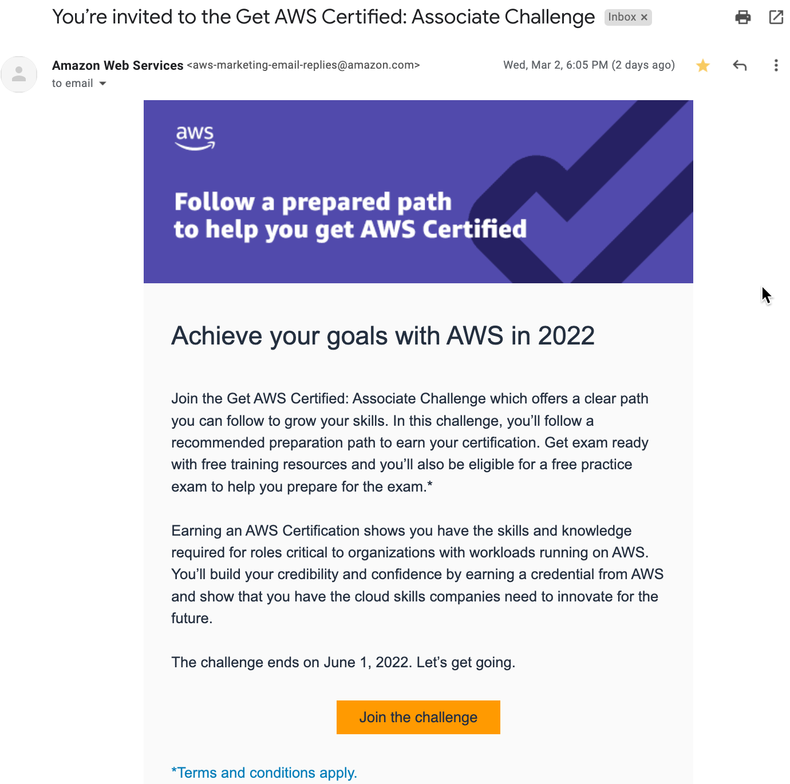
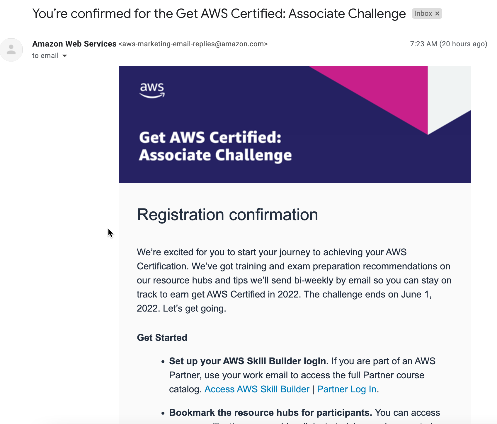
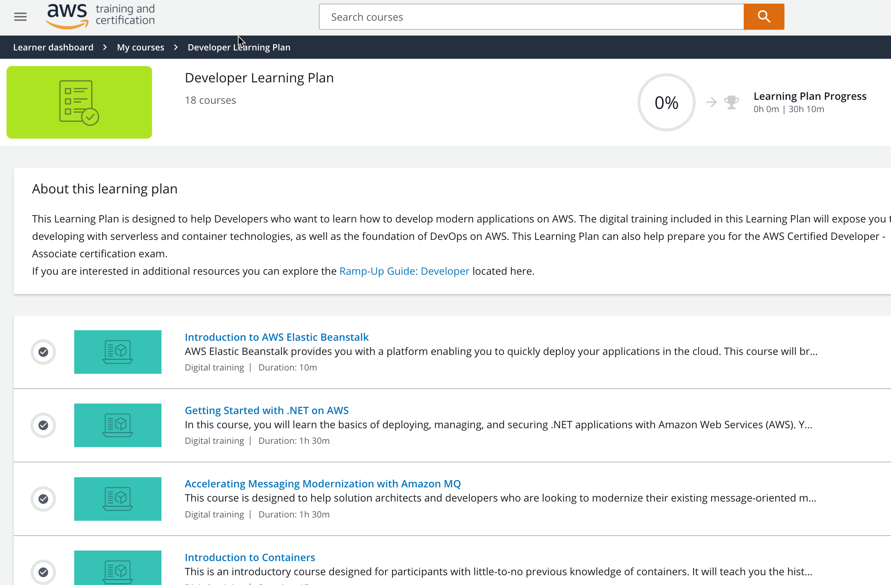

[Home](../../) > [Cloud](../CloudDev/) > [AWS](./)

  

# AWS Developer Certification Blog

Chronicaling my journey to getting my AWS Developer Cloud Associate certification here in 2022.

These are rough notes which I may use to help create a polished Article series on the topic once I am done.

**March 29, 2022**

First Course: Introduction to AWS Elastic Beanstalk

AWS Elastic Beanstalk provides you with a platform enabling you to quickly deploy your applications in the cloud. This course will briefly discuss the different components of the AWS Elastic Beanstalk solution, and perform a demonstration of the service.

One way to get your app into the cloud quickly is to use Elastic Beanstalk

- It is a PaaS (Platform as a Service)
- Allows quick deployment of your applications
- Reduces the management complexity (but you can maintain full control if you desire)
- Keeps control in your hands
- Supports a large range of platforms (inc .Net, Go, Python, Node but not Rust)
- You can simply focus on supplying your code, EB supplies everything else
- Deployment and Updates - very easy

In the second half of this short course, there is a demonstration of creating an application using Elastic Beanstalk.

**March 27, 2022**

I am throwing out a goal to at least look at 30 minutes or more of training every day going forward. Rain or shine - if it is early morning or 10pm, to not break the chain. Sometimes the hardest part is starting each day, but consistency wins in most things I put serious effort towards so I need to apply that here. Some days will be better than others. but I aim to write at least something here about what I learned or listened to.

Undoubtedly - there will be some training, maybe most of it, where I need to listen twice. So 30 hours of training should be doubled or tripled for my estimate of what I need to get myself close to a place for achieving readiness for this exam, and having a good grasp of the content. Let's make it simple and put my goal to be 100 hours of effort - and see where this gets me. 100 hours to go through the digital training, write notes on it, and practice.

My journal here I am hoping will be the rough notes for a series of blog articles I can then deliver out on Medium, and/or my blog or LinkedIn.

**March 26, 2022**

More information for sharing about this certification, I found this in the ramp-up guide:

> Learn how to build modern applications on AWS using microservices, containers, and serverless technologies using the programming language of
> your choice. You'll also be exposed to the foundational principles of DevOps and continuous integration/continuous delivery (CI/CD) on AWS. This
> guide can also help prepare you for the AWS Certified Developer – Associate certification exam. If you're interested specifically in digital courses and labs to help you develop these skills, explore the Developer Learning Plan at explore.skillbuilder.aws.

[AWS Ramp-Up Guide: Developer](https://d1.awsstatic.com/training-and-certification/ramp-up_guides/Ramp-Up_Guide_Developer.pdf)

There are several suggested Classroom Trainings included in this guide, however I am strictly looking to complete the digital training and assess how ready I would be to take the exam with the free practice exam they will provide.

The cost of the exam itself is $150. I would like to ask my company if I do pass the exam, would they be willing to reimburse me for this expense.

**March 25, 2022**

I am looking at the Developer Learning Plan on the AWS Skillbuilder site.

The AWS Developer Learning Plan is broken up into 18 courses, as follows (inc. duration of course):

- Intro to AWS Elastic Beanstalk (10min)
- Getting Started with .Net on AWS (1hr 30min)
- Accelerating Messaging Modernization with Amazon MQ (1hr 30min)
- Introduction to Containers (15min)
- Introduction to AWS Fargate (10min)
- Deep Dive on AWS Fargate: Building Serverless Containers at Scale (40min)
- Deep Dive on Container Security (30min)
- Amazon Elastic Container Service (ECS) Primer (30min)
- Amazon Elastic Kubernetes Service (EKS) Primer (1hr)
- Introduction to Serverless Development (4hr 25min)
- Getting into the Serverless Mindset (30min)
- AWS Lambda Foundations (1hr)
- Amazon API Gateway for Serverless Applications (1hr 15min)
- Amazon DynamoDB for Serverless Architecture (2hr)
- Architecting Serverless Solutions (3hr)
- Getting Started with DevOps on AWS (8hr)
- Build and Deploy APIs with a Serverless CI/CD (1hr 45min)
- Exam Readiness: AWS Certified Developer - Associate (Digital) (2hr)

**March 24, 2022**

I decided to share this goal with my FTE company manager as a personal goal for myself which could be beneficial for my overall performance rating at the end of the year. Doing so means I needed to put together some details for sharing this in my work goal planner. This did not take much time. An interesting item is that I have been told that my department is focused on trying to find a good way to get developers up to speed on AWS since this is the primary cloud platform being utilized. So, I have a task to share my knowledge on what I am doing with someone. Who knows, maybe it might be helpful for more than just myself to become a SME on AWS for my department.

**March 17, 2022**

I signed up to AWS's Certification Challenge this month, from an email invitation I received.

I have previously completed Azure training (did not pursue the certification exam however) back in 2021, when Microsoft had the superior free training available out of the big 3 cloud platforms (AWS, Azure, Google Cloud). I am glad to see that AWS has stepped up with their free training offerings as well, and I am hopeful the experience will be similar. I will be able to provide some insight on how Azure and AWS training compares, although to be fair to Microsoft I might want to re-visit their training as they may have made updates as well.

The incentive for the AWS challenge is that if I complete 30.5 hours of structured training by June 1st, then I am eligible for a free practice exam to help prepare for the real deal. 30.5 hours is a lot - it is a commitment to really learn the content so you have internalized it. It is doable and needs to be intentionally planned for that sake, given my schedule and other commitments. But beyond that - hey, challenge on!

Let me detail how this started. First, I received the email invitation. I would suspect that started based on my creating an AWS account and specifying something that indicated I was a software engineer.

**Anyway, this is what i received by email:**

  

**Next, after registering for the Associate Challenge, I received this:**

  

**And this resulted in my getting access to the AWS Skill Builder Portal:**

  

And since AWS is apparently very interested in keeping you engaged in the challenge and your journey to certification, they have an active pipeline of information they will feed you via email once they know you are interested or signed up. Today I received a notice on a 2.5 hour seminar around the topic of the exam itself. I plan to register and at least record it, but hopefully attend it as well, depending on my day job commitments.

**Here is what they sent today:**

  

To wrap up my first entry on this journey, I'll say I am excited and looking forward to gaining my certification in 2022. Who knows, this might lead to more AWS or even other cloud certifications. This first cert will be a milestone for sure.
