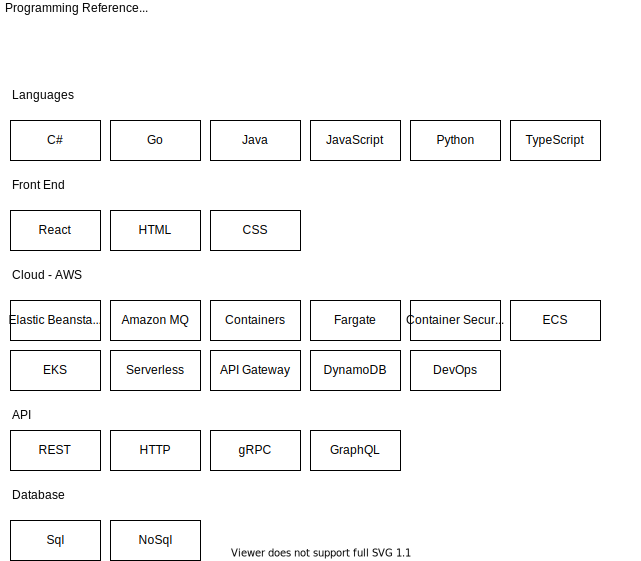

# Welcome to The Code Garage

This is the GitHub home for The Code Garage, a place for sharing information, reference links to other great resources I have found, and my learnings on a wide array of subjects in programming.

I created this programming reference initially just for myself, however if anyone else finds it of any use, great.

By the way, I would encourage any programmer to at least consider creating their own reference information, a sort of 'living journal' for their craft, where they could continue to add notes over time.

I have laid out a large number of subjects below which I have either used, or I want to learn about and use. All have initially started as placeholders to add information, and the challenge to myself is to fill each of them in with information that I find helpful.

One might ask, "Why do this?" Why create a copy of what is already easily available? Just google it. There are plenty of great resources out there. I agree. And I still encourage making full use of those resources. I came to the conclusion that as I wanted to study the areas in programming and really have them stick in my brain, that I should write about them, because I agree with the notion that `writing is thinking`.

So even if this is not helpful to anyone else but myself that is more than enough reason to work on this programming reference. Being able to organize so much information in my brain in a way to utilize it better, and have a place to go and refresh myself on a subject quickly, even add additional notes anytime, is of great value.

In total, I see the following benefits for providing this personal programming reference to include:

- Internalizing all of the important features of this language. The very act of writing them out forces me to think and contemplate on them.
- Removing all mystery around the subject. Having a full view of the feature landscape eliminates that uneasy feeling that there is functionality available which I do not know about, which I am ignorant of. It is possible to arrive at that place where one can say "that is about everything I need to know" about this area.
- Having a place to add my own notes, adding my own context and explanations, and possibly also include scenarios where this feature is especially helpful. Including other helpful information around the subject which might also help the information to 'stick' in my brain.
- Including helpful reference links on features which others have also explained, provided sample code for, expanded upon. Hearing 2 to 3 explanations on a topic from different sources helps give a more well-rounded view.
- Providing examples which I can use for later practice.
- Finally, enabling me to arrive at a place where I can move from the internalization of features to the far more interesting application of them. In other words, moving from concrete knowledge transfer of features to the abstract use of them to solve problems.

**Languages**

- [C#](./csharp/)
- [Go](./go/)
- [Java](./java/)
- [JavaScript](./javascript/)
- [Python](./python/)
- [Typescript](./typescript/)

**Front End**

- [React](./react/)
- [HTML](./html/)
- [CSS](./CSS/)

**Cloud**

- [Cloud Reference](CloudDev/)
- [AWS](CloudDev/AWS/)
- [Azure](CloudDev/Azure/)
- [Google Cloud](CloudDev/GoogleCloud/)

**API**

- [REST APIs](/rest-api/)
- [HTTP APIs](/http-api/)
- [gRPC APIs](/grpc-api/)
- [GraphQL APIs](/graphql-api/)

**Database**

- [SQL](structured-query-language/)
- [No Sql](nosql/)

### First Use of this Reference - Installing Prerequisites

After you pull this repo down and open it in VSCode, you may encounter a series of warning messages, around missing dependencies to run certain code.

Of course these are all optional, depending on whether or not you are interested in executing a certain language's code in this repo. Decide which languages are of interest to you and follow the guides to get your environment set up properly. Here is a summary of these prerequisites by language:

- C#
  - Install the [C# extension from Microsoft](https://marketplace.visualstudio.com/items?itemName=ms-dotnettools.csharp)
- Java -
  - Install the [JDK](https://www.oracle.com/java/technologies/downloads/)
  - [Set path of the jdk/bin directory](http://www.javatpoint.com/how-to-set-path-in-java)
- Go -
  - Install the proper [Go binary release](https://go.dev/dl/)
- Python
  - Install the [Python Prerequisites](https://code.visualstudio.com/docs/python/python-tutorial#_prerequisites)
- JavaScript
  - Install [Node](https://nodejs.org/en/)
- TypeScript
  - Install Typescript using NPM or Yarn (`npm install -g typescript`)

### Cloud Training

Each of the major cloud providers have free training available to help you prepare for their certification exams:

- [Free AWS Sill Builder Training](https://explore.skillbuilder.aws/learn)
  - [Developer Learning Plan](https://explore.skillbuilder.aws/learn/public/learning_plan/view/84/developer-learning-plan)
- [Microsoft Learn: Free Azure Certified Developer Training](https://docs.microsoft.com/en-us/learn/azure/)
  - [Developer Learning Paths](https://docs.microsoft.com/en-us/learn/roles/developer)
- [Google Cloud Training](https://community.c2cglobal.com/product-updates)
  - [Google Cloud Developer Training](https://docs.microsoft.com/en-us/learn/roles/developer)

###### _Note: The above diagram was created in vscode, using the [unofficial Draw.io Extension](https://marketplace.visualstudio.com/items?itemName=hediet.vscode-drawio), worth checking out!_
