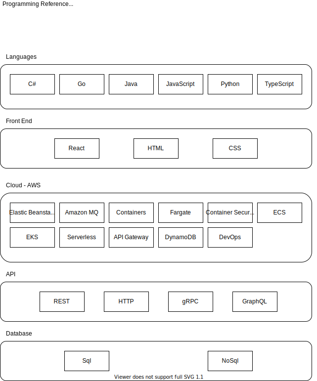

###### _Note: The above diagram was created in vscode, using the [unofficial Draw.io Extension](https://marketplace.visualstudio.com/items?itemName=hediet.vscode-drawio), which is worth checking out._

**Languages**

- [C#](./csharp/)
- [Go](./go/)
- [Java](./java/)
- [JavaScript](./javascript/)
- [Python](./python/)
- [Typescript](./typescript/)

**Front End**

- [React](./react/)

**Cloud**

- [Cloud Reference](./cloud/)
- [AWS](cloud/aws/)
- [Azure](azure/)
- [Google Cloud](googlecloud/)

**API**

**Database**

### First Use of this Reference - Installing Prerequisites

After you pull this repo down and open it in VSCode, you may encounter a series of warning messages, around missing dependencies to run certain code.

Of course these are all optional, depending on whether or not you are interested in executing a certain language's code in this repo. Decide which languages are of interest to you and follow the guides to get your environment set up properly. Here is a summary of these prerequisites by language:

- C#
  - Install the [C# extension from Microsoft](https://marketplace.visualstudio.com/items?itemName=ms-dotnettools.csharp)
- Java -
  - Install the [JDK](https://www.oracle.com/java/technologies/downloads/)
  - [Set path of the jdk/bin directory](http://www.javatpoint.com/how-to-set-path-in-java)
- Go -
  - Install the proper [Go binary release](https://go.dev/dl/)
- Python
  - Install the [Python Prerequisites](https://code.visualstudio.com/docs/python/python-tutorial#_prerequisites)
- JavaScript
  - Install [Node](https://nodejs.org/en/)
- TypeScript
  - Install Typescript using NPM or Yarn (`npm install -g typescript`)

### Cloud Training

Each of the major cloud providers have free training available to help you prepare for their certification exams:

- [Free AWS Sill Builder Training](https://explore.skillbuilder.aws/learn)
  - [Developer Learning Plan](https://explore.skillbuilder.aws/learn/public/learning_plan/view/84/developer-learning-plan)
- [Microsoft Learn: Free Azure Certified Developer Training](https://docs.microsoft.com/en-us/learn/azure/)
  - [Developer Learning Paths](https://docs.microsoft.com/en-us/learn/roles/developer)
- [Google Cloud Training](https://community.c2cglobal.com/product-updates)
  - [Google Cloud Developer Training](https://docs.microsoft.com/en-us/learn/roles/developer)
