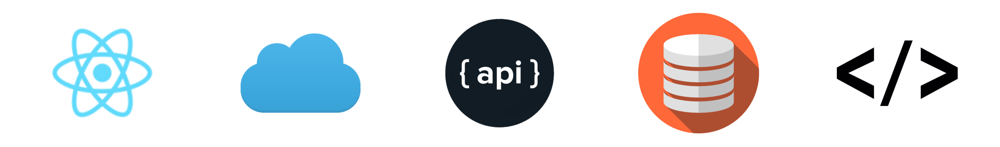

  

<h4 align="center">
  Reference Notes And Curated Content on Programming Topics
</h4>

**Front End**

- [React](./react/)
- [HTML](./html/)
- [CSS](./css/)

**Cloud**

- [Cloud Reference](CloudDev/)
  - [AWS](/AWS/)
  - [Azure](/Azure/)
  - [Google Cloud](/GoogleCloud/)

**API**

- [API Development](apis/)
  - [REST](/rest-api/)
  - [HTTP](/http-api/)
  - [gRPC](/grpc-api/)
  - [GraphQL](/graphql-api/)

**Database**

- [SQL](structured-query-language/)
- [No Sql](nosql/)

**Languages**

- [Programming Languages](./languages/)
  - [C#](./csharp/)
  - [Go](./go/)
  - [Java](./java/)
  - [JavaScript](./javascript/)
  - [Python](./python/)
  - [Typescript](./typescript/)

**Other Resources**

- [WebAssembly](./webassembly/)
- [Git](./git/)
- [Design Patterns](./designpatterns/)
- [Algorithms](./algorithms/)
- [Refactoring](./refactoring/)
- [Testing](./testing/)
- [IDEs](./ides/)
- [Containerization](./containerization/)
- [Markdown](./markdown/)
- [Books](./books/)
- [Postmortems](./postmortems/)
- [Miscellaneous](./other/)

This is the GitHub home for The Code Garage, a place for sharing my learnings and reference links on a wide array of subjects in programming. I encourage anyone to at least consider creating their own reference information, a sort of 'living journal' for their craft, where they can continue to add notes over time.

The subjects include both those I am acquainted with or that I am eager to pursue learning. I began this project in 2022, and my hope is that I can have all of my notes over time consolidated here by the end of the year.

There are seemingly endless resources already available on all of these subjects, so one might ask, "Why do this?" I came to the conclusion that as I wanted to study the areas in programming and really have them stick in my brain, that I learn and retain information better when I write about them. Other benefits for myself include:

- Internalizing all of the important features of a subject, whether it is a language, framework, pattern, practice, or platform. The very act of writing about them out forces me to think and contemplate about the subject at length. `Writing Is Thinking.`
- Removing mystery around the subject. For me at least, mystery often breeds anxiety, so having a full view of the feature landscape eliminates that uneasy feeling that there is functionality available which I do not know about, which I am ignorant of. My aim is to become competent in all areas of interest.
- Having a home for adding my own notes, additional context, explanations, and scenarios where this feature is especially helpful.
- Including helpful reference links on features which others have also explained, provided sample code for, expanded upon. I have found that hearing 2 to 3 explanations on a topic from different sources is helpful to gain a more well-rounded view.
- The ultimate goal of abstract application for the purposes of solving real world problems.

### Cloud Training

Each of the major cloud providers have free training available to help you prepare for their certification exams:

- [Free AWS Skill Builder Training](https://explore.skillbuilder.aws/learn)
  - [Developer Learning Plan](https://explore.skillbuilder.aws/learn/public/learning_plan/view/84/developer-learning-plan)
- [Microsoft Learn: Free Azure Certified Developer Training](https://docs.microsoft.com/en-us/learn/azure/)
  - [Developer Learning Paths](https://docs.microsoft.com/en-us/learn/roles/developer)
- [Google Cloud Training](https://community.c2cglobal.com/product-updates)
  - [Google Cloud Developer Training](https://docs.microsoft.com/en-us/learn/roles/developer)

And here is something for those who enjoy [a little programming humor](./humor/)
