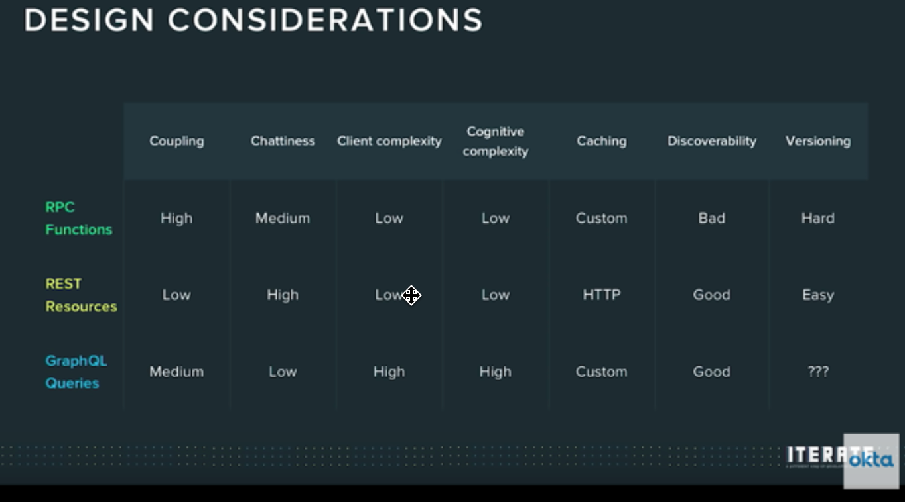

[Home](../)

# API Development Reference

### Reference Links

- [APIs You Won't Hate](https://apisyouwonthate.com/) - Phil Stergoen
- [ProgrammableWeb.com API University](https://www.programmableweb.com/api-university/api-developer-training) - some great resources for getting up to speed in API development. Also a huge directory of publicly available APIs that you can use.
- [Zapier: An Introduction to APIs](https://zapier.com/learn/apis/)
-

[My 'list of lists' for Public Apis'](./apidirectory.md) - other folks have already created some great lists of public APIs.

### Styles

- [REST](../rest-api/)
- [HTTP](../http-api/)
- [gRPC](../grpc-api/)
- [GraphQL](../graphql-api/)
- Minimal - new area to research...

### Tools

- [Postman](./postman)

### Topics in APIs

- Versioning
- Rate Limiting

### Making money from APIs you create

If you have an idea for an API that others would benefit from, you can create it, host it, and then market it over at [RapidAPI.com](https://rapidapi.com). The process to setup your account and add your first API to the marketplace is quick and easy.

### Documenting APIs / HATEOS

I do not think API documentation should be necessary in most cases - but this course below seems to talk about this: (using HATEOAS - APIs should have everything you need inside them)
https://idratherbewriting.com/learnapidoc/docapis_introtoapis.html

**HATEOAS Principle**

- Hypermedia as the engine of application state
- provide the information needed to interact with the server
- states that every response from the server to a client includes the information needed to interact with all other resources available on the server

### Recommendations -

Mgmt API -

- Consider REST (HAL, JSON-API, Ion)

Microservices (mainly Action-oriented - such as a Slack bot, or microservices - a high volume of messages)

- consider RPC (gRPC, Twirp) or REST

Data or Mobile API -

- consider GraphQL - data is graph-like. Optimize for high latency
- Github is using it to provide a vesion of their public-facing API

for any new project - approach it with a use case based style - try a few small cases with a particular approach and see if it works well.

**General - API Design Considerations:**

- coupling - how bound to the underlying system they are. Performance may be an influencer on how loose or tight you choose them to be
- chattiness - amount of latency / overhead over the network
- client complexity
- cognitive complexity
- caching
- discoveratbility
- versioning

**References:**

- Nate Barbettini – API Throwdown: RPC vs REST vs GraphQL, Iterate 2018
- https://www.youtube.com/watch?v=VjXb3PRL9WI
- Les Hazlewood on REST API design
- YouTube: Eric Baer on GraphQL
- Phil Sturgeon’s book https://philsturgeon.uk (and his other site: https://apisyouwonthate.com/ ) Phil talks about the proper use of each different approach

  

