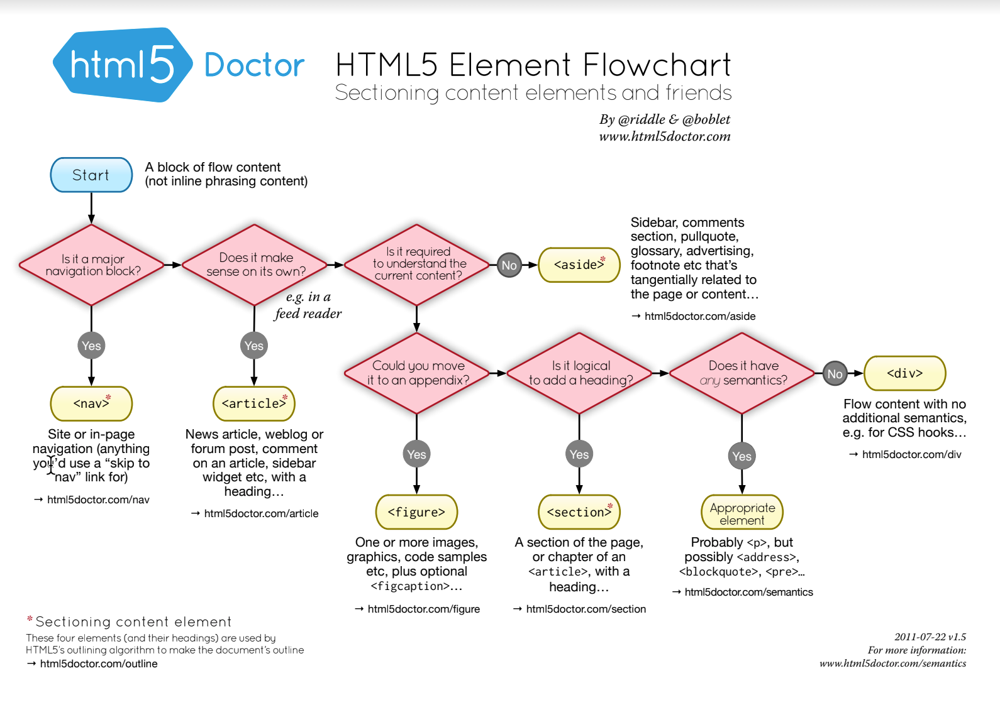

[Home](../)

# HTML Reference

### Highlights

- Created:
- Created By:
- Characteristics:

### Summary Description

### Notes on GET and POST requests

**GET**

- GET requests can be cached
- GET requests remain in the browser history
- GET requests can be bookmarked
- GET requests should never be used when dealing with sensitive data
- GET requests have length restrictions
- GET requests should be used only to retrieve data

**POST**

- POST requests are never cached
- POST requests do not remain in the browser history
- POST requests cannot be bookmarked
- POST requests have no restrictions on data length

### Sectioning content elements and friends

  

