[Home](../)

# Programming Humor

<i>Levity helps lighten the load</i>

  

### Links

- [Gifs Collection](GifsGalore.md)
- [Imgur Programming Memes](https://imgur.com/search/score?q=programming+memes)

  

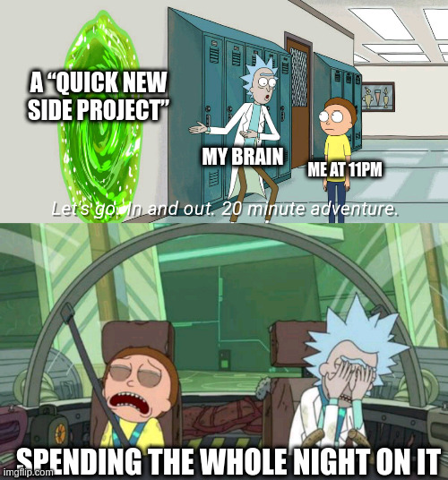

  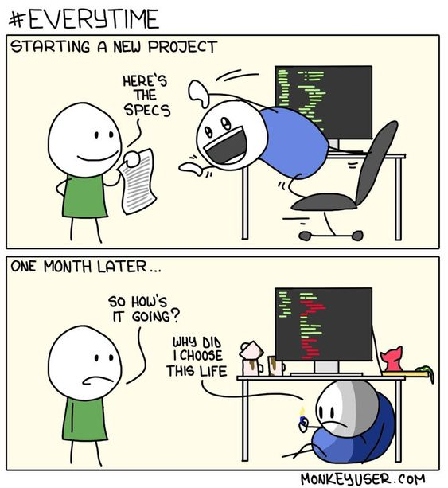

  

  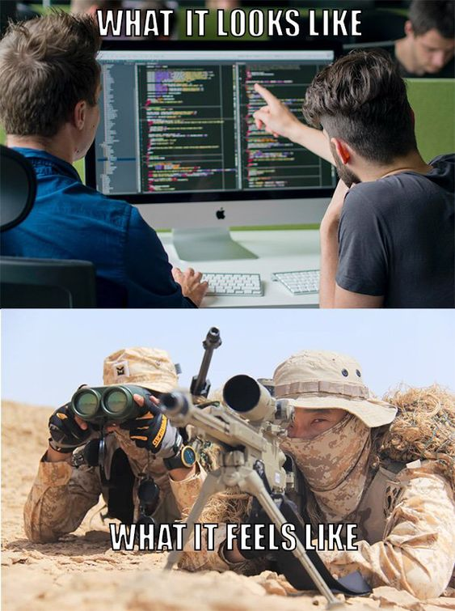

  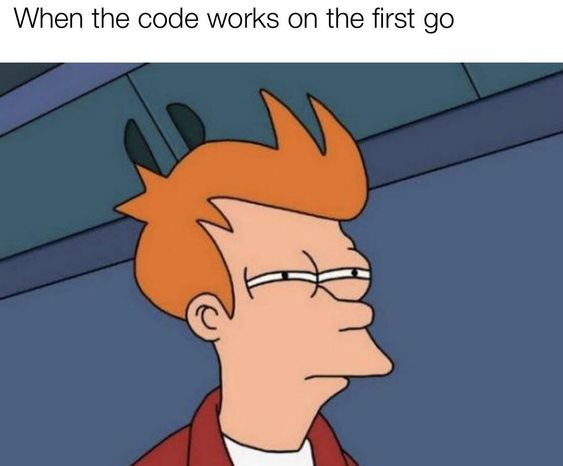

  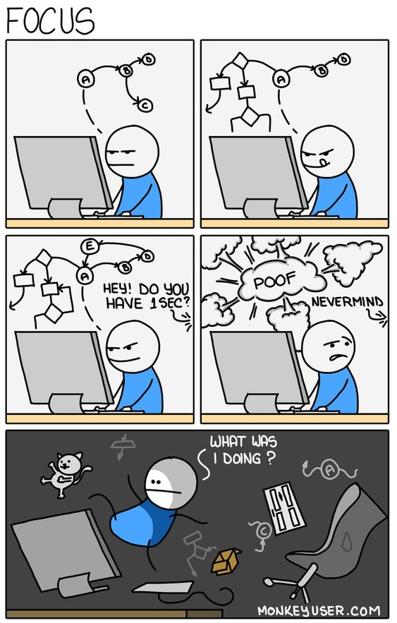

  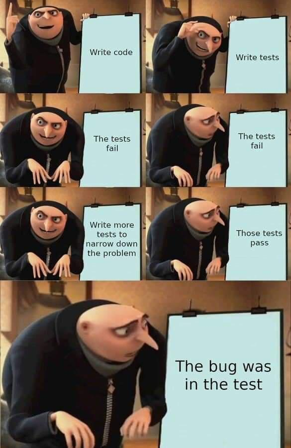

  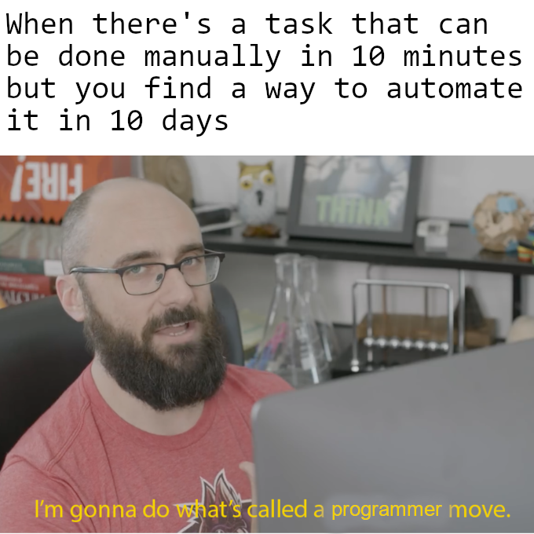

  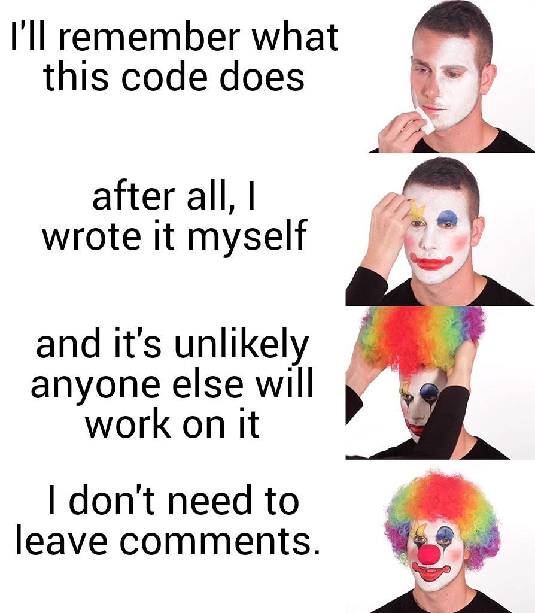

  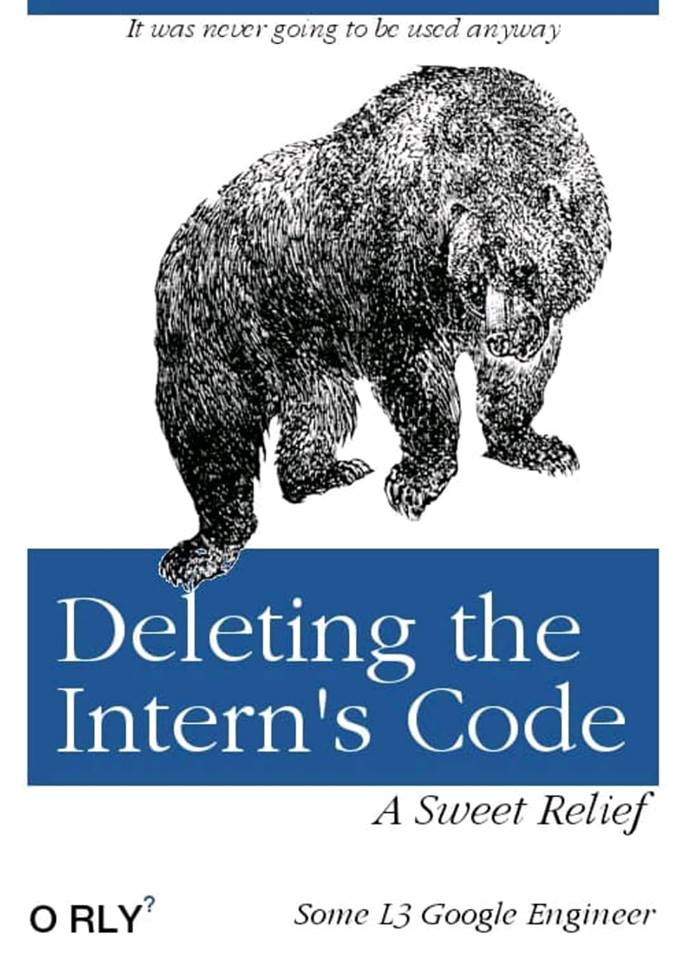

  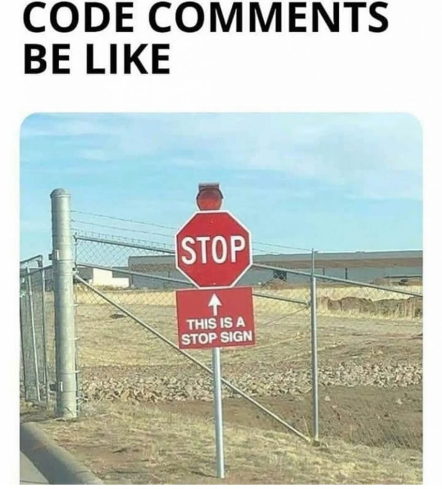

  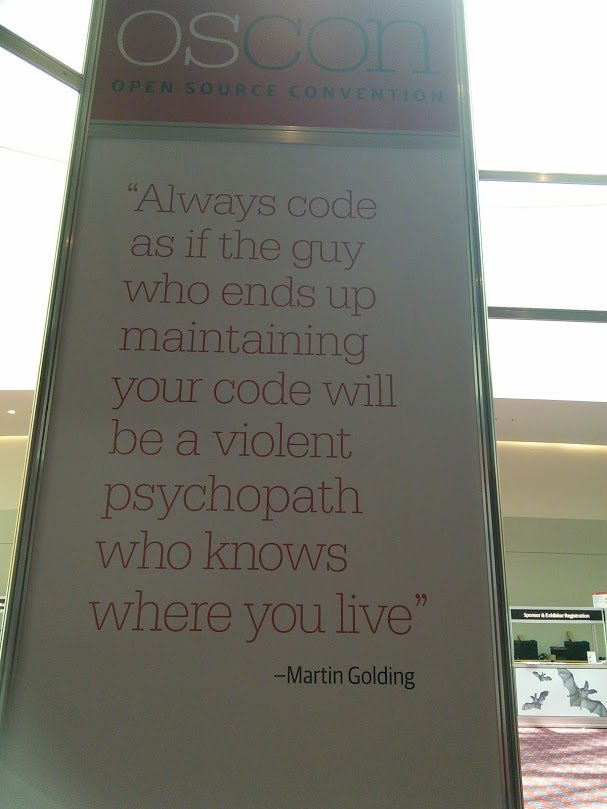

  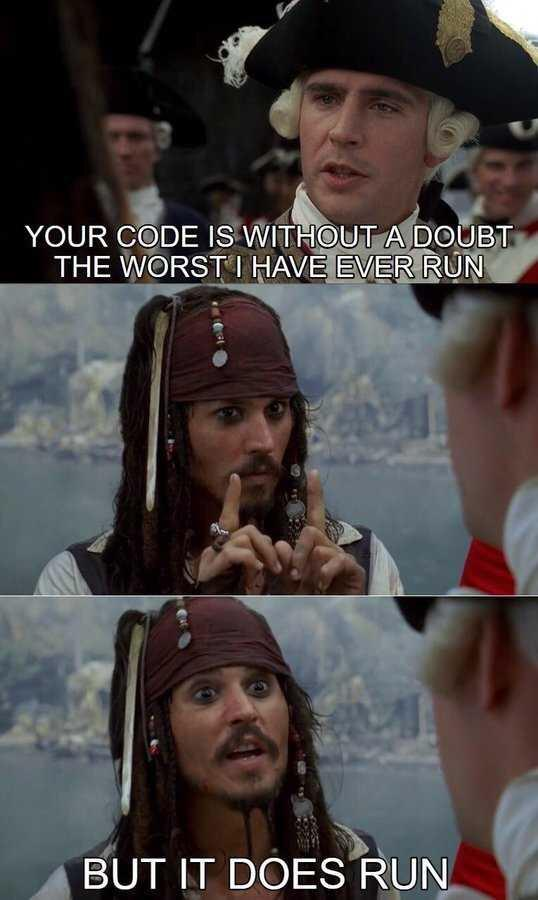

  

  

  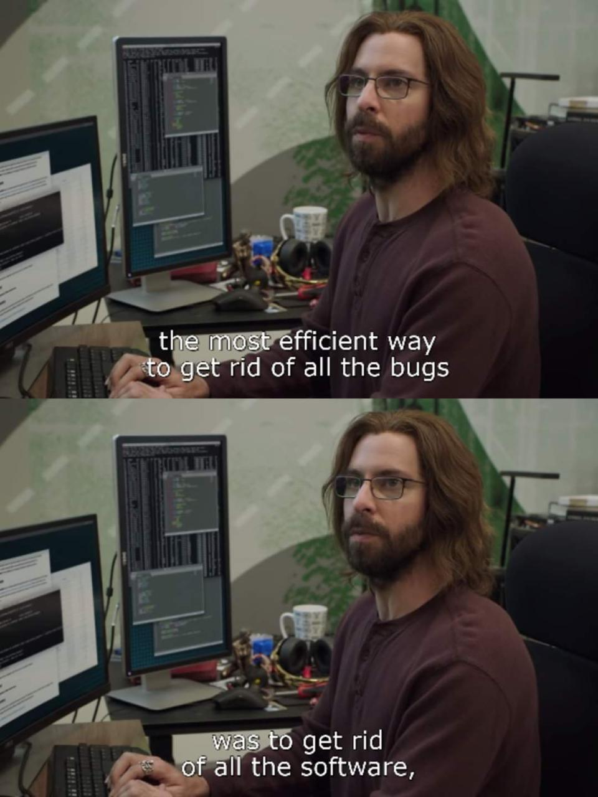

  

  

  

  

  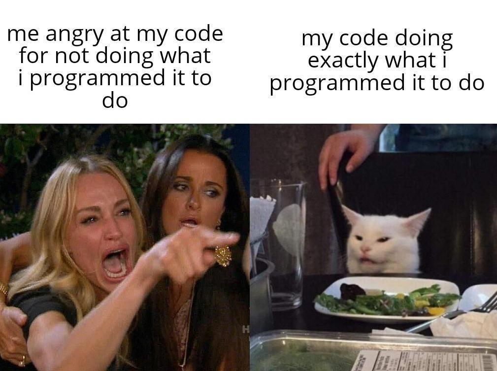

  

  

  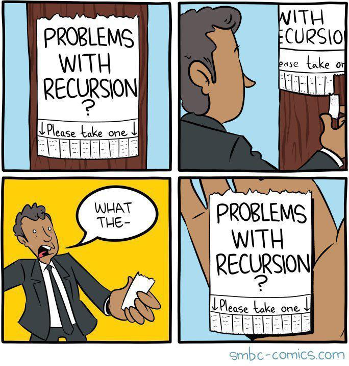

  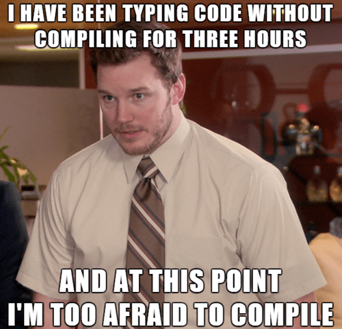

  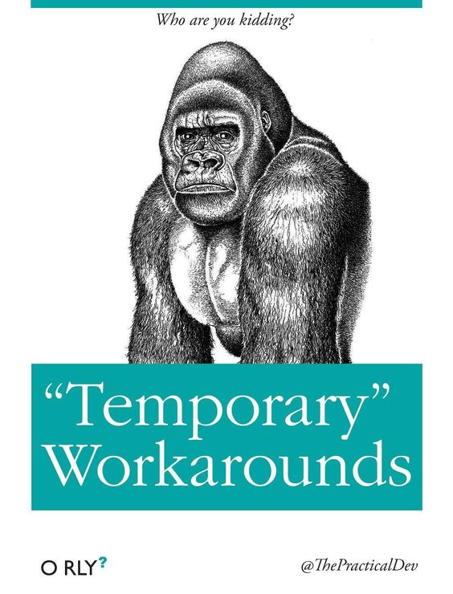

  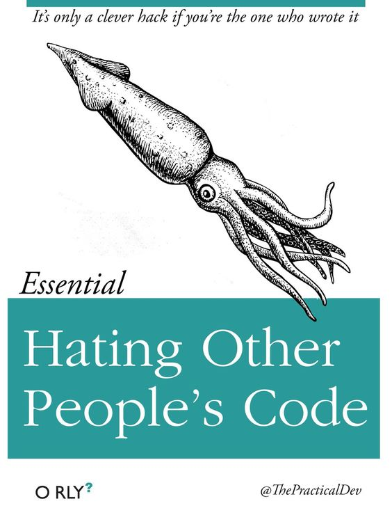

  <!--  -->

  <!--  -->

  <!--  -->

  <!--  -->

  <!--  -->

  <!--  -->

  <!--  -->

  <!--  -->
